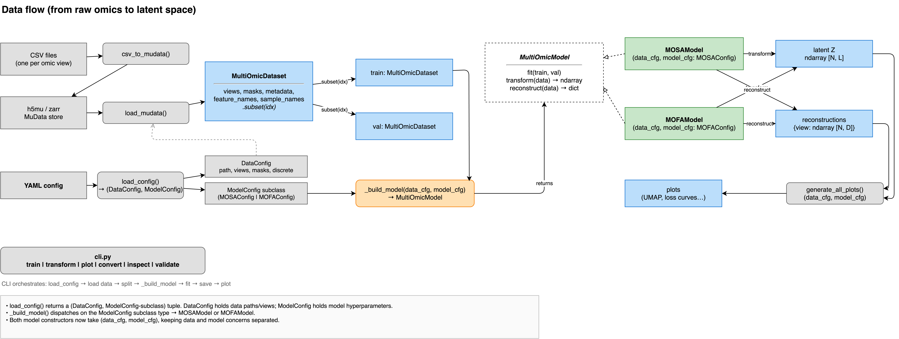

# Getting started

MOSA integrates several omic views of the same samples into one shared latent space using a conditional variational autoencoder. It runs as a command-line tool driven by a single YAML config file.



## Requirements

You need Python 3.11 or newer. A GPU is optional. MOSA trains on CPU, and on Apple silicon through `mps`, but processing real datasets is much faster on CUDA hardware.

## Installation

```bash
git clone <repository-url>
cd mosa

python -m venv .venv
source .venv/bin/activate        # Windows: .venv\Scripts\activate

pip install -e .
```

This installs every command. The only optional piece is the MOFA backend (`model.type: mofa`), which needs mofapy2 and mofax:

```bash
pip install -e ".[mofa]"
```

Confirm the installation worked by checking the help output:

```bash
mosa --help
```

### Updating

Update before testing or reporting a bug. Reinstalling picks up any changed dependency versions:

```bash
git pull
pip install -e .
```

Checkpoints are tied to the MOSA version that trained them. A checkpoint written by an older version may not load in a newer one, so use checkpoints trained with your current version.

### On a shared server

Training over SSH only survives network disconnections if the process runs in the background. Start your training run inside a multiplexer like `tmux` or `screen`:

```bash
tmux new -s mosa
source .venv/bin/activate
mosa train --config <your-config>.yaml
# Press Ctrl-b then d to detach; type tmux attach -t mosa to resume
```

Set `model.accelerator` and `model.devices` in your configuration file to specify hardware. The default `auto` setting uses a GPU if one is available.

## Standard run

A complete workflow requires five steps. You should run the first two before training, as they are computationally cheap and catch most configuration mistakes early.

```bash
# 1. Check the data
mosa inspect --input <data>.h5mu

# 2. Check the config against that data, without training
mosa validate --config <your-config>.yaml

# 3. Train
mosa train --config <your-config>.yaml

# 4. Diagnostics
mosa plot --config <your-config>.yaml

# 5. Project new samples through the trained model
mosa transform --checkpoint <output-dir>/checkpoints/last.ckpt \
               --input <new-samples>.h5mu \
               --output <projection-dir>/ --reconstruct
```

Step 3 writes model checkpoints and output parquet files to the path specified in `model.output_dir`. Read the [Outputs](06-outputs.md) page for details.

## Acquiring data

MOSA reads MuData files (`.h5mu` or `.zarr`). You can acquire a dataset in two ways:

- Use a provided file. Run `mosa inspect --input <data>.h5mu` to verify the views it contains and their names. You must add those names to the `data.views` configuration block.
- Convert per-view tables into a single file using `mosa convert`. Read the [Preparing data](02-preparing-data.md) page for details.

## Minimal configuration

```yaml
data:
  path: <data>.h5mu
  views: [gexp, meth]

model:
  type: mosa_vae
  output_dir: <output-dir>
  views:
    gexp:
      hidden_layer_dims: [512, 256]
    meth:
      hidden_layer_dims: [512, 256]
```

Every omitted key falls back to a default value. The view names listed under `model.views` must exactly match the list in `data.views`. Both must match the view names stored inside the file.

See also: [Preparing data](02-preparing-data.md) · [Configuration](03-configuration.md) · [Commands](../index.md#commands)
