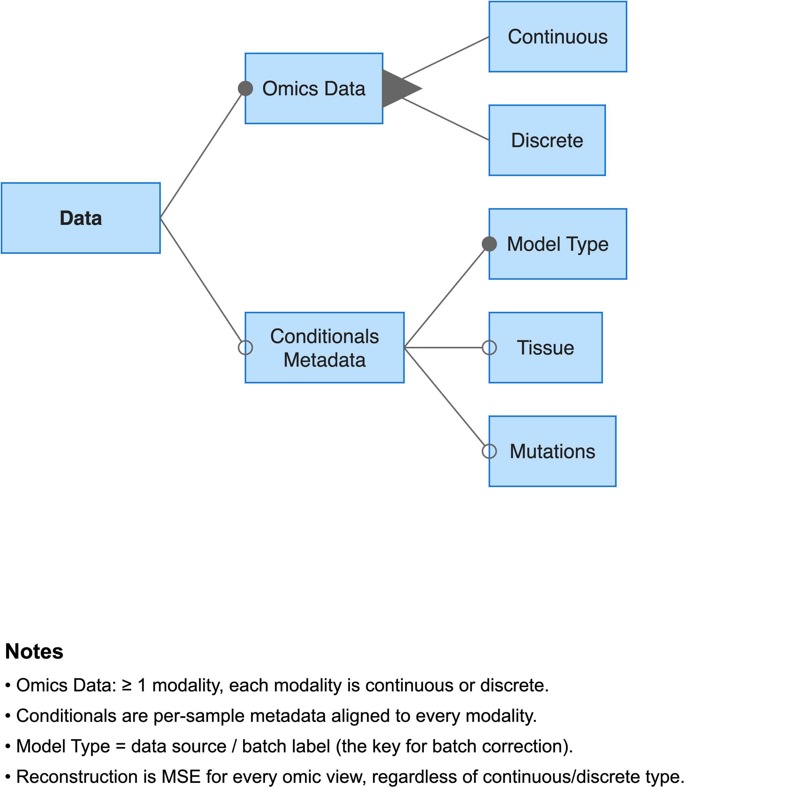

# Preparing data

MOSA reads MuData files. You can use the `mosa convert` command to build a MuData file from per-view tables and a sample metadata table.



## Input tables

You must provide omic view files structured as a features-by-samples matrix. Features go down the rows, and sample IDs go across the columns. The first column holds the feature identifiers.

```
              SIDM00001   SIDM00002   SIDM00003
SLC7A11        6.42        5.11        7.30
CDKN2A         2.10        NaN         3.02
```

The converter accepts `.csv`, `.tsv`, `.txt`, `.tab`, `.parquet`, and `.pq` formats. Delimited files can be compressed (`.gz`, `.bz2`, `.xz`, `.zip`). You can represent missing values as empty cells or as `NaN`.

You must also provide a conditionals file. This is the sample metadata table, containing one row per sample:

| Column | Required | Meaning |
|---|---|---|
| `model_id` | yes | Sample identifier. Must match the view column names. |
| `model_type` | yes | Data source or batch label. It serves as the key for batch correction, and the label folds are stratified on it. |
| `tissue` | no | Tissue of origin. Including it enables tissue conditioning and the contrastive loss. |

You can optionally provide a mutations file. This file must be a binary features-by-samples matrix. The conversion process turns each row into a `mutation_*` column in the sample metadata, making them available as conditional inputs.

## Converting

```bash
mosa convert \
  --conditionals <conditionals>.csv \
  --view gexp:<gexp>.csv \
  --view meth:<meth>.csv \
  --output <data>.h5mu
```

The string before the colon in the `--view` argument assigns the view its name. This name is used everywhere else in the tool, including in `data.views`, `model.views`, and output filenames.

You can repeat a view name to assemble a single view from multiple files. The converter concatenates the samples and unions the features across the provided files:

```bash
mosa convert --conditionals <conditionals>.csv \
  --view gexp:<cell-lines>.csv \
  --view gexp:<organoids>.csv \
  --output <data>.h5mu
```

The `convert` command never scales, imputes, or filters feature values. It only reshapes and aligns the data. The exact numerical values you input are what it writes to the output file.

### Alignment

The converter aligns every view and the metadata onto a single, sorted sample axis. This axis represents the union of samples across all views, restricted to the samples described in the metadata. A view receives all-NaN rows for any samples it lacks.

The tool drops samples present in a view but missing from the metadata, and vice versa. The conversion report counts both cases. A high drop count usually indicates a mismatch in ID formatting:

```
Conversion report
  Samples
    in metadata:                      40
    in at least one view:             40
    matched on both:                  40
    dropped, no metadata:              0
    dropped, no view data:             0
    final:                            40
  Views
    gexp                120 features      40 / 40 samples present
    meth                 80 features      34 / 40 samples present
  Samples by view count
    1 view:                            6
    2 views:                          34
```

If data providers name the same sample differently, you can use the `--id-map` flag to apply a crosswalk table before alignment. The map file requires `source_id` and `model_id` columns. The tool applies this map to every view, but not to the metadata or mutations tables, which it assumes are already canonical.

### Filtering

| Flag | Effect |
|---|---|
| `--min-views N` | Keep only samples holding real values in at least N views. Using `--min-views 2` with two views keeps only completely observed samples. |
| `--filter COLUMN=VAL[,VAL...]` | Keep only samples whose metadata column matches a specific value. You can repeat this flag across multiple columns. |
| `--shared-features` | Reduce every view to the features they all share. This is only valid when all views use a single identifier namespace, such as when every view is summarised to the gene level. |
| `--on-collision first` | Keep the first occurrence instead of raising an error when two source columns resolve to the same sample ID. |

These flags select samples and, in the case of `--shared-features`, features. They never modify the underlying numerical values.

## File contents

Each view in the output file contains the value matrix `X` and a boolean `mask` layer. The mask is set to `True` for every observed value.

The sample metadata sits in the `.obs` attribute. It holds every column from the conditionals table (not just `model_type` and `tissue`), all generated `mutation_*` columns, and a boolean `has_<view>` column for each view. Any extra columns present in the input metadata are carried through untouched, which makes the `--filter` flag useful for subsetting on custom variables later.

The `has_<view>` columns and the mask layers answer different questions. The `has_<view>` column indicates whether the sample appeared in that view's input file at all. The mask indicates whether a real value was recorded for a specific feature. Since a sample missing from a view entirely and a sample present but with entirely missing values both produce an all-NaN matrix row, the mask alone cannot distinguish them. The presence columns exist to resolve this ambiguity.

This difference means the two reports can legitimately disagree:

```
# convert:  gexp   120 features      40 / 40 samples present     <- in the file
# inspect:  gexp: 120 features | 35/40 samples present           <- with real values
```

In this example, five samples appeared as columns in the gene expression input file but contained no actual values.

> Note: Files generated before the presence columns were added do not contain them, but they still load correctly.

> Note: The MuData library reserves `obsm[<view name>]` for its own membership vectors and recomputes them on every write. Any custom data stored there is silently discarded. MOSA derives per-sample presence from the mask layer and the `has_<view>` columns, never from `obsm`.

## Verification

```bash
mosa inspect --input <data>.h5mu
```

The [inspect](04-commands/07-inspect.md) page describes the printed output in detail.

You should check several things before training:

- Ensure the feature counts match your input tables. If a feature count equals the sample count, you likely transposed an input table.
- Verify the value ranges match the original data. The `inspect` command will flag any view where all values are approximately zero.
- Check that the sample IDs look like actual identifiers rather than row numbers.
- Confirm the `model_type` counts match your expectations. The cross-validation folds are stratified on this column. A class containing fewer than two samples will block the train/val split from functioning.

## Discrete views

You can list views that hold discrete values in the `data.discrete_views` configuration key. The model never scales these views, and it fills any missing entries with zero. The model treats all other views as continuous and preprocesses them according to the `model.preprocessing_mode` setting.

See also: [Configuration](03-configuration.md) · [convert](04-commands/06-convert.md) · [inspect](04-commands/07-inspect.md)
