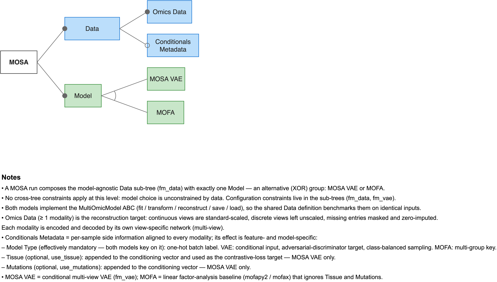

# Configuration

You define an experiment using a single YAML configuration file. This file contains three top-level blocks: `data` and `model` are required, while `evaluation` is optional.

```yaml
data:
  path: <data>.h5mu
  views: [gexp, meth]

model:
  type: mosa_vae
  output_dir: <output-dir>
  joint_latent_dim: 64
  views:
    gexp:
      hidden_layer_dims: [512, 256]
    meth:
      hidden_layer_dims: [512, 256]

evaluation:
  test_size: 0.1
  n_folds: 5
```



The tool treats an unknown configuration key as a fatal error, rather than silently ignoring it. The error message will suggest the closest valid name if you make a typo:

```
Error: Unknown key 'laten_dim' in model:. Did you mean 'joint_latent_dim'?
```

You can run `mosa validate --config <your-config>.yaml` to verify a configuration file and the data it references without starting a training run.

## data

The `data` block describes the dataset. Every model implementation reads this block.

| Key | Type | Default | Description |
|---|---|---|---|
| `path` | `str` | `""` | Path to the `.h5mu` file or `.zarr` directory. |
| `views` | `list[str]` | `[]` | Views to load, by name. Must match the view names in the file. May not be empty. |
| `mask_layer_name` | `str` | `mask` | Name of the layer holding the missing-value mask. |
| `discrete_views` | `set[str]` | `[]` | Views whose values are discrete. These are not scaled. Must be a subset of `views`. |
| `use_tissue` | `bool` | `true` | Use the `tissue` column as a conditional input. Ignored when the column is absent. |
| `use_mutations` | `bool` | `true` | Use the `mutation_*` columns as conditional inputs. Ignored when none are present. |

The `views` key selects which views to load by name. These names must exist in the file. It is entirely standard to load fewer views than the file contains; the tool simply ignores the rest.

## evaluation

The `evaluation` block determines how data is held out for validation. It is optional. If you omit it, the tool uses the defaults listed below.

| Key | Type | Default | Description |
|---|---|---|---|
| `test_size` | `float` | `0.1` | Fraction held out for validation during `train`. A value of `0` trains on everything and skips the validation loop entirely. Must be in `[0, 1)`. |
| `n_folds` | `int` | `5` | Number of cross-validation folds. Must be at least 2. |
| `strategy` | `str` | `stratified` | Fold assignment method. Setting it to `stratified` balances `model_type` across folds. Setting it to `kfold` ignores `model_type`. |
| `shuffle` | `bool` | `true` | Shuffle the data before assigning folds. Setting it to `false` creates folds from contiguous blocks in the original sample order. |

The `test_size` key only applies to `mosa train`, which uses it to split off a validation set stratified by `model_type`. The `n_folds`, `strategy`, and `shuffle` keys apply to `mosa cross-validate` and to each individual trial run by `mosa optimize`.

Model implementations never read this block, and a hyperparameter search cannot optimise these values.

## model

The `model.type` key selects the model implementation. This choice dictates which keys the rest of the block accepts. The currently registered types are `mosa_vae` and `mofa`.

The following keys apply to every model type:

| Key | Type | Default | Description |
|---|---|---|---|
| `output_dir` | `str` | `outputs` | Directory for checkpoints, logs, and output parquets. |
| `random_seed` | `int` | `42` | Seed for Python, NumPy, and Torch random number generators, as well as the train/val split. |

## model, for `type: mosa_vae`

### Architecture

| Key | Type | Default | Description |
|---|---|---|---|
| `views` | `dict[str, view config]` | `{}` | Per-view architecture, keyed by view name. Keys must match `data.views` exactly. |
| `joint_latent_dim` | `int` | `64` | Dimensionality of the shared latent space. Must be positive. |
| `fusion_method` | `str` | `concat` | How per-view embeddings become one latent space. Setting it to `concat` concatenates them. Setting it to `poe` combines them as a Product of Experts. |
| `shared_hidden_layer_dims` | `list[int]` | `[]` | Hidden layers applied after fusion, before the latent head. An empty list means none. |
| `poe_use_shared_head` | `bool` | `true` | Applicable to PoE only. Setting it to `true` derives mu and logvar from a shared head. Setting it to `false` gives each view its own head. When `true`, every view's final `hidden_layer_dims` entry must match. |
| `view_dropout_prob` | `float` | `0.2` | Probability of dropping an entire view during training. This forces the latent representation to survive missing views. Must be in `[0, 1)`. |

The `views` key requires a mapping keyed by view name. These keys must match the list in `data.views` exactly. The tool treats a mismatch as a fatal error, not a warning. Each view entry accepts:

| Key | Type | Default | Description |
|---|---|---|---|
| `hidden_layer_dims` | `list[int]` | `[512, 256]` | Encoder hidden layer sizes. The decoder mirrors them. Must be non-empty and all positive. |
| `loss_type` | `str` | `mean` | Setting it to `mean` averages reconstruction error over all entries. Setting it to `macro` averages per `model_type` group first, ensuring small groups are not drowned out by large ones. |
| `dropout_p` | `float` | `0.1` | Dropout probability inside this specific view's encoder and decoder. Must be in `[0, 1)`. |
| `recon_weight` | `float` | `1.0` | Multiplier on this view's reconstruction loss. Must be positive. |

```yaml
model:
  views:
    gexp:
      hidden_layer_dims: [1024, 512]
      loss_type: macro
      dropout_p: 0.1
    meth:
      hidden_layer_dims: [1024, 512]
```

### Losses

| Key | Type | Default | Description |
|---|---|---|---|
| `kl_weight` | `float` | `0.00015625` | Weight on the KL term. The KL calculation sums over `joint_latent_dim` before averaging over the batch, meaning its magnitude scales directly with the latent size. The default value is `0.01 / 64`. |
| `kl_weight_final` | `float` | `0.00015625` | KL weight reached at the end of the warmup schedule. Only read when `use_kl_scheduler` is true. |
| `kl_warmup_epochs` | `int` | `0` | Epochs over which the KL weight transitions from `kl_weight` to `kl_weight_final`. Only read when `use_kl_scheduler` is true. |
| `use_kl_scheduler` | `bool` | `false` | Ramps the KL weight over `kl_warmup_epochs` instead of holding it fixed. |
| `contrastive_weight` | `float` | `0.0` | Weight on the tissue-based contrastive loss. Setting it to `0` disables it entirely. It automatically degrades to zero if a `tissue` column is absent. |
| `adv_weight` | `float` | `0.0` | Weight on the adversarial batch-correction loss. Setting it to `0` disables the discriminator entirely. It has no effect if the data contains fewer than two `model_type` categories. |
| `adv_focal_gamma` | `float` | `0.0` | Focal-loss gamma for the adversarial cross-entropy. A value of `0` applies standard cross-entropy. Must be >= 0. |

### Optimiser

| Key | Type | Default | Description |
|---|---|---|---|
| `learning_rate` | `float` | `0.001` | Learning rate for the VAE optimiser. Must be positive. |
| `adv_learning_rate` | `float` | `0.001` | Learning rate for the discriminator optimiser. Must be positive when `adv_weight > 0`. |
| `lr_scheduler` | `str` | `none` | Setting it to `none` holds the learning rate fixed. Setting it to `step` decays it by `lr_gamma` every `lr_step_size` epochs. |
| `lr_step_size` | `int` | `100` | Epochs between learning-rate decays. Only read when `lr_scheduler` is `step`. |
| `lr_gamma` | `float` | `0.5` | Multiplier applied at each decay step. Only read when `lr_scheduler` is `step`. |

### Training loop

| Key | Type | Default | Description |
|---|---|---|---|
| `num_epochs` | `int` | `200` | Maximum training epochs. Must be positive. The early stopping callback may end training sooner. |
| `batch_size` | `int` | `64` | Samples per mini-batch. Must be positive. |
| `scaler_sample_frac` | `float` | `1.0` | Fraction of training samples used to fit the scalers. This is only read by the lazy `.zarr` path. Must be in `(0, 1]`. |
| `weighted_random_sampler` | `bool` | `true` | Samples mini-batches using inverse-frequency weights to ensure `model_type` groups appear in balanced proportions. |
| `use_adv_class_weights` | `bool` | `true` | Weights the adversarial cross-entropy by inverse class frequency. |
| `inference` | `bool` | `false` | Directs the model to write a counterfactual `inference/` split, reconstructing every sample as if it originated from the `target_batch`. |
| `target_batch` | `str` | `""` | The `model_type` to project onto when `inference` is true. Leaving it empty defaults to the first category. It must name a category present in the data. |
| `preprocessing_mode` | `str` | `standardize` | Determines how continuous views are preprocessed. Setting it to `standardize` applies a z-score per feature. Setting it to `center` subtracts the per-`model_type` group mean. Setting it to `none` only imputes missing entries using group means. |

### Lightning trainer

| Key | Type | Default | Description |
|---|---|---|---|
| `accelerator` | `str` | `auto` | Lightning accelerator. Options are `auto`, `cpu`, `gpu`, or `mps`. |
| `devices` | `int | str` | `auto` | Number of devices, or `auto`. Must be >= 1 when provided as an integer. |
| `precision` | `str` | `32` | Numeric precision. Options are `32`, `16-mixed`, or `bf16-mixed`. |
| `gradient_clip_val` | `float` | `0.0` | Gradient-norm clipping threshold. Setting it to `0` disables clipping. Must be >= 0. |
| `accumulate_grad_batches` | `int` | `1` | Number of batches to accumulate before taking an optimiser step. Must be >= 1. |
| `early_stopping_patience` | `int` | `20` | Epochs without validation improvement before training stops. This requires a validation split. |
| `checkpoint_top_k` | `int` | `3` | Number of top checkpoints to retain. Setting it to `0` disables checkpointing entirely. |
| `num_workers` | `int` | `0` | Number of DataLoader worker processes. Setting it to `0` loads data in the main process. |

## model, for `type: mofa`

MOFA is included to allow benchmarking against identical data. It requires the optional `mofapy2` and `mofax` packages.

The `mofa` extra supports CPU training. To run with `gpu_mode: true`, install CuPy separately using the wheel that matches your CUDA toolkit. For example, with CUDA 12.x:

```bash
pip install -e ".[mofa]"
pip install cupy-cuda12x
```

GPU training requires an NVIDIA GPU and a compatible CUDA driver. See the [CuPy installation guide](https://docs.cupy.dev/en/stable/install.html) for other CUDA versions and setup options.

| Key | Type | Default | Description |
|---|---|---|---|
| `n_factors` | `int` | `50` | Number of factors to infer. Must be positive. |
| `ard_factors` | `bool` | `true` | Applies automatic relevance determination to the factors. |
| `drop_r2` | `float` or `null` | `0.001` | Drops factors that explain no more variance than this threshold in every view and group. `null` keeps every factor. |
| `scale_views` | `bool` | `false` | Scales views to unit variance before fitting. |
| `scale_groups` | `bool` | `false` | Scales groups to unit variance before fitting. |
| `convergence_mode` | `str` | `fast` | Convergence tolerance. Options are `fast`, `medium`, or `slow`. |
| `iterations` | `int` | `1000` | Maximum number of training updates. Must be positive. `train` warns when a run stops at this cap without converging. |
| `gpu_mode` | `bool` | `false` | Enables GPU training through CuPy. Requires an NVIDIA GPU and a CuPy installation compatible with the server's CUDA version. mofapy2 falls back to CPU if CuPy cannot be imported. |
| `gpu_device` | `int` or `null` | `null` | CUDA device index (non-negative), used when `gpu_mode: true`. `null` uses CuPy's current device. |

MOFA supports held-out reconstruction, cross-validation, and optimization for Gaussian views and groups present during training. It projects unseen samples by joint minimum-norm least squares over observed features, using the training group means and scaling factors. Masked views contribute no observations, but every trained view and its exact feature order must remain in the input. Samples with no observed features, unknown groups, and non-Gaussian projection are rejected. Fitted sample IDs retain their learned factors and changed fitted values are rejected; use new IDs for new observations. Projection is a deterministic estimate from learned weights, not MOFA posterior inference. Validation data does not drive MOFA fitting or early stopping. Inference works after `fit()` and after loading a MOSA artifact containing preprocessing metadata; plain mofapy2 artifacts cannot project. MOFA treats `-2147483648` (R's integer missing-value code) as missing, like a masked entry.

## Cross-block checks

The tool identifies some errors only when it evaluates multiple blocks together. The `mosa validate` command reports these without loading the matrices into memory:

- The `model.views` and `data.views` keys must list identical view names.
- The `data.discrete_views` set must be a subset of `data.views`.
- Using PoE fusion with `poe_use_shared_head: true` requires every view's final `hidden_layer_dims` entry to match.
- The `model.target_batch` key must specify a `model_type` category that is present in the data.

Conditions that degrade functionality rather than causing outright failure produce warnings. These include a missing `tissue` column when `use_tissue: true`, an absence of `mutation_*` columns when `use_mutations: true`, or an `adv_weight > 0` when the data contains fewer than two `model_type` categories.

See also: [The MOSA VAE](08-the-mosa-vae.md) · [validate](04-commands/08-validate.md) · [Hyperparameter search](05-hyperparameter-search.md)
