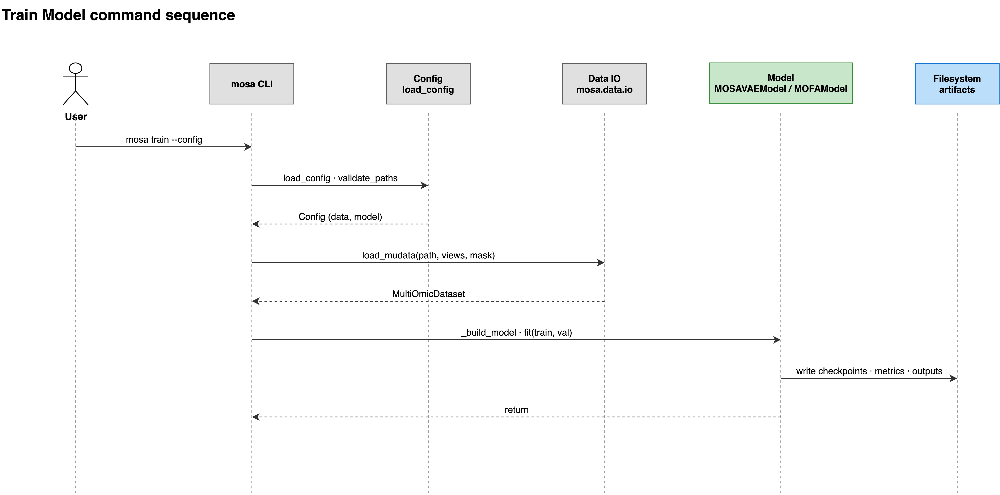

# train

The `train` command fits a model on the dataset specified in your configuration file. It writes checkpoints and output parquets into the directory defined by `model.output_dir`.

```bash
mosa train --config <your-config>.yaml
```

| Flag | Type | Required | Description |
|---|---|---|---|
| `-c`, `--config` | path | yes | Path to the YAML configuration file. |
| `-r`, `--resume` | `CKPT` | no | Resume training from an existing Lightning checkpoint (`.ckpt`). |



## Description

The command loads the dataset and then partitions it into training and validation sets. It stratifies this split by `model_type` when `evaluation.test_size` is strictly greater than zero. It builds the model architecture based on `model.type` and begins the fitting process. Upon completion, it writes the final latent representations and reconstructions for each data split.

Setting `evaluation.test_size: 0` disables the validation set entirely. The command runs no validation loop, disables early stopping, and generates no checkpoints, because it only attaches those callbacks when a validation split exists. The run still produces its final output parquets, but it will not produce a `last.ckpt` file for the [transform](02-transform.md) command to load later.

## Outputs

The command populates `model.output_dir` with checkpoints, Lightning logs, and paired latent and reconstruction parquets for each data split. The [Outputs](../06-outputs.md) page documents this exact directory layout.

## Limitations

- Training does not resume automatically if interrupted. If you restart a run without passing the `--resume` flag, the tool overwrites the existing contents of the `output_dir`.
- The tool requires at least 2 samples per `model_type` category to perform the stratified split. If a category is too small, training aborts with an error rather than silently falling back to an unstratified split.

See also: [Configuration](../03-configuration.md) · [Outputs](../06-outputs.md) · [plot](05-plot.md)
