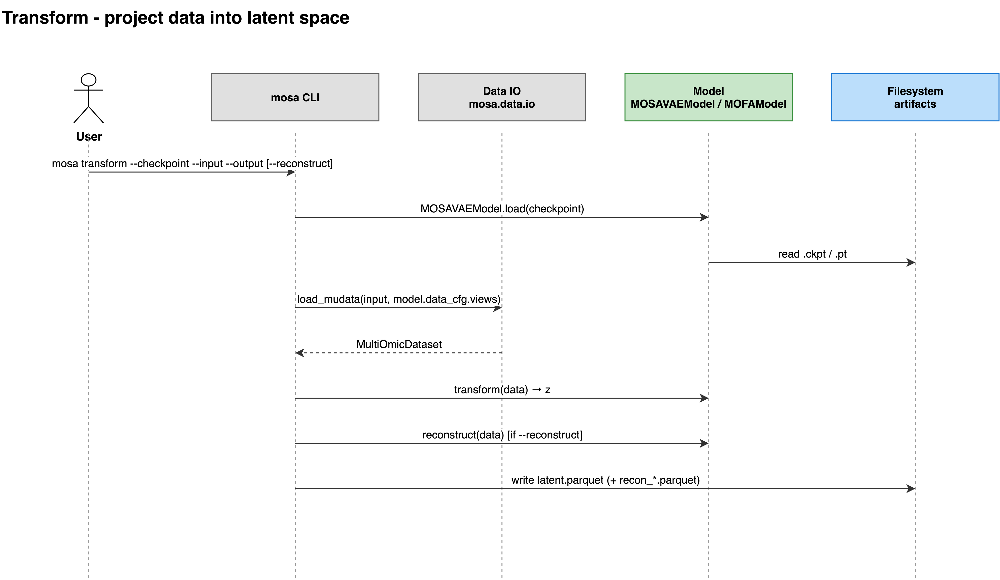

# transform

Projects a dataset into the latent space of a saved model, without training.

```bash
mosa transform --checkpoint <output-dir>/checkpoints/last.ckpt \
               --input <new-samples>.h5mu \
               --output <projection-dir>/ \
               --reconstruct
```

| Flag | Type | Required | Description |
|---|---|---|---|
| `-m`, `--checkpoint` | path | yes | Path to saved model checkpoint (.ckpt) |
| `-i`, `--input` | path | yes | Path to .h5mu or .zarr input data |
| `-o`, `--output` | path | yes | Directory to write latent.parquet (and reconstructions) |
| `-r`, `--reconstruct` | flag | no | Also write per-omic reconstruction parquets |



## Description

The checkpoint carries its own data configuration, so no config file is
needed: the views to load, their names, and the mask layer all come from the
saved model. Which class is restored is decided by the file: each model
recognises its own files, `.ckpt` or `.pt` for a MOSA VAE and an `.hdf5` in
mofapy2's layout for MOFA. MOFA files written by mofapy2 directly, or by MOSA
before September 2026, carry no data configuration; they load with the default
mask layer name, `mask`.

Writes `latent.parquet` to the output directory, indexed by sample ID, one row
per sample and `joint_latent_dim` columns. With `--reconstruct`, also writes
`recon_<view>.parquet` per view. Once every result has been computed, any
`recon_*.parquet` already in the output directory is removed before writing,
so the directory never mixes results from two runs. A run that fails leaves
the directory untouched.

## Limitations

- It never refits. The scalers and categories learned during training are
  applied as they are; the input data does not influence them.
- A `model_type` value that did not appear during training raises, rather than
  being mapped to something arbitrary.
- Input missing a view the checkpoint needs raises, naming both what the
  checkpoint expects and what the input holds. Extra views in the input are
  ignored.
- A MOFA model only returns the factors it learned for its training samples.
  It raises for samples it was not trained on, and for training samples whose
  values or feature order changed since training.
- A view whose feature names or their order differ from training raises,
  because the model reads features by position.
- For a MOFA model, `--reconstruct` raises for views MOFA fit with a
  `bernoulli` or `poisson` likelihood (see [Outputs](../06-outputs.md)).

See also: [Outputs](../06-outputs.md) · [train](01-train.md)
