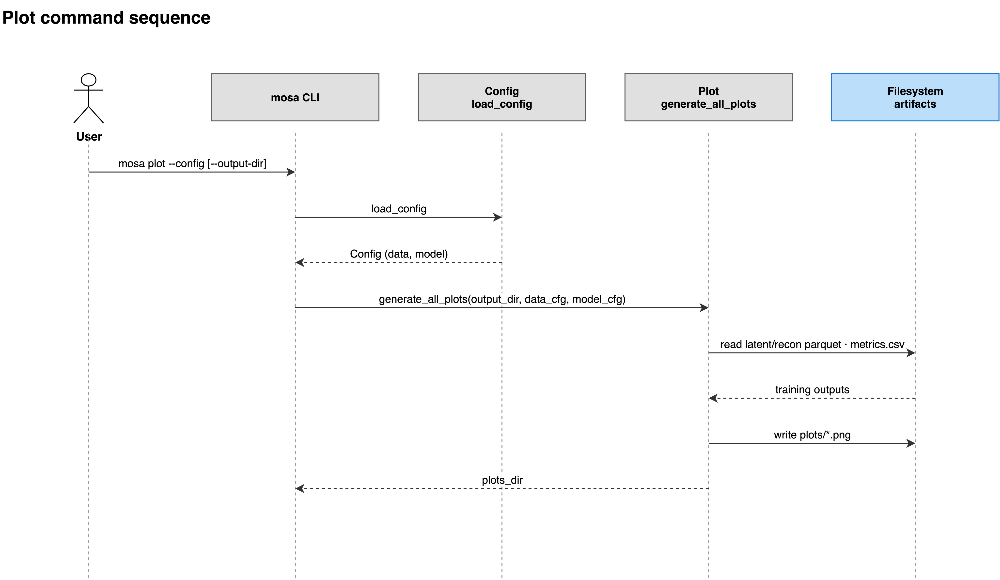

# plot

Generates diagnostic figures from a finished training run.

```bash
mosa plot --config <your-config>.yaml
```

| Flag | Type | Required | Description |
|---|---|---|---|
| `-c`, `--config` | path | yes | Path to YAML config file |
| `-o`, `--output-dir` | path | no | Path to training output directory (defaults to model.output_dir in config) |



## Description

Reads the parquets and the Lightning metrics log written by `train`, plus the
dataset itself at `data.path`, since the input values are needed for the
reconstruction scatter plots and the sample metadata for colouring. Figures go
to `<output_dir>/plots/`, and `clustering_metrics.csv` to
`<output_dir>/metrics/`. Nothing is plotted during training itself.

Every figure is coloured by `tissue`, so unlike every other command, `plot`
requires a `tissue` column and fails without one.

Latent representations are read from the `full/` split, falling back to
`train/`. Loss curves come from `lightning_logs/version_*/metrics.csv`, using
the latest version directory.

What each figure shows is described in [Plots](../07-plots.md).

## Limitations

- It does not train, and does not load the model. A run directory with no
  outputs in it produces an error naming the paths that were searched.
- `--output-dir` changes where outputs are *read from* as well as written to;
  it points the whole command at a different run.

See also: [Plots](../07-plots.md) · [Outputs](../06-outputs.md)
