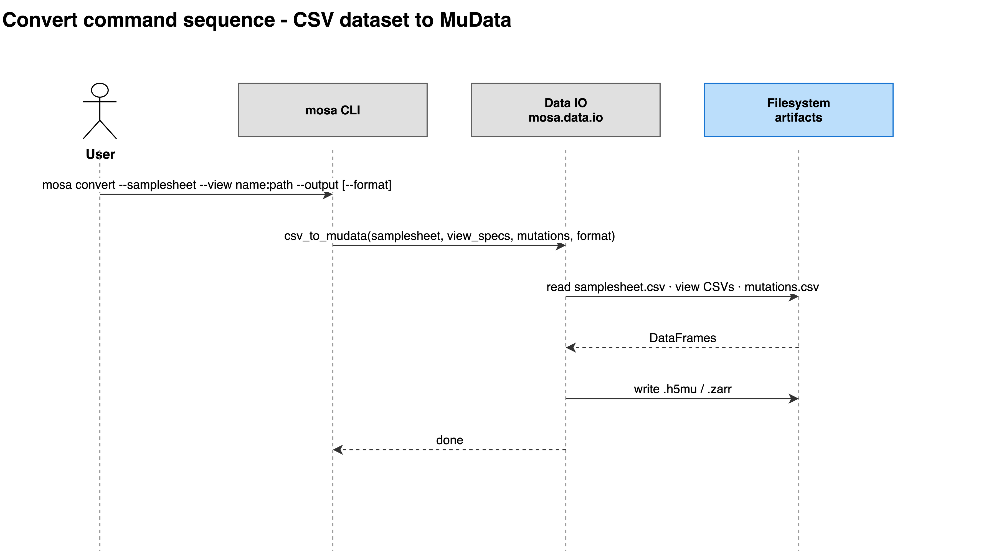

# convert

Builds a MuData file from per-view tables and a sample metadata table.

```bash
mosa convert \
  --conditionals <conditionals>.csv \
  --view gexp:<gexp>.csv \
  --view meth:<meth>.csv \
  --output <data>.h5mu
```

| Flag | Type | Required | Description |
|---|---|---|---|
| `-m`, `--conditionals` | path | yes | Path to conditionals CSV (required columns: model_id, model_type; optional: tissue) |
| `-v`, `--view` | `name:path` | yes | View spec as 'name:path' (e.g. 'gexp:data/gexp.parquet'). Repeat for each view. Repeating the same name assembles that view from several files: samples concatenate, features union. Formats: .csv, .tsv, .txt, .parquet (delimited ones may be .gz). Repeatable. |
| `-M`, `--mutations` | path | no | Path to mutations CSV (features x samples, binary). Each row becomes a mutation_* column in .obs. |
| `-I`, `--id-map` | path | no | Sample-ID crosswalk table (columns: source_id, model_id) applied to every view before alignment. Use it when providers name the same sample differently. |
| `-x`, `--on-collision` | `error` \| `first` | no | What to do when two columns resolve to one sample ID (default: error). |
| `-n`, `--min-views` | int | no | Keep only samples with data in at least N views (default: 1, keep all). |
| `-F`, `--filter` | `COLUMN=VAL[,VAL...]` | no | Restrict samples to metadata rows whose COLUMN is one of the listed values (e.g. 'model_type=Cell_Line,Organoid'). Repeat for several columns. Repeatable. |
| `-s`, `--shared-features` | flag | no | Reduce every view to the features they all share. Only valid when all views use one identifier namespace (e.g. every view at gene level). |
| `-o`, `--output` | path | yes | Output file path (.h5mu or .zarr) |
| `-f`, `--format` | `h5mu` \| `zarr` | no | Output format (default: h5mu) |



## Description

Reads each view (features × samples), aligns everything onto one sorted sample
axis, and writes `.h5mu` or `.zarr`. Input formats, alignment rules, and the
conversion report are covered in [Preparing data](../02-preparing-data.md).

All inputs are validated before anything is written (column requirements,
orientation, and numeric content), so a failure leaves no partial output.

## Limitations

- A view whose sample IDs match nothing in the metadata raises, showing example
  IDs from both sides.
- Two source columns resolving to one sample ID raise, unless
  `--on-collision first` is given.
- A `--view` argument without a colon raises, since the view would otherwise be
  nameless.

See also: [Preparing data](../02-preparing-data.md) ·
[inspect](07-inspect.md)
