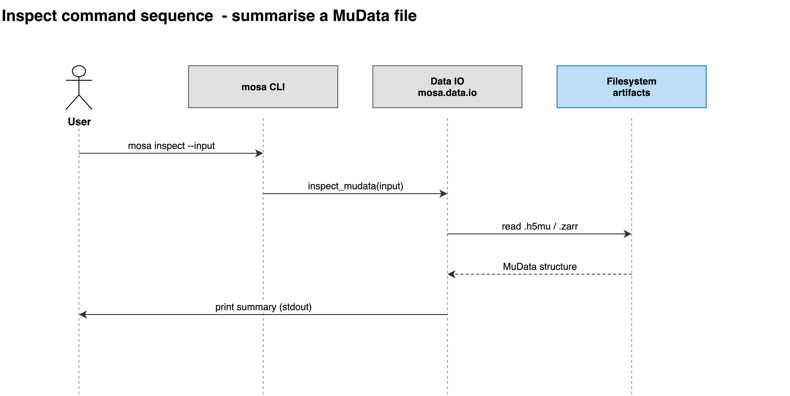

# inspect

Prints a summary of a MuData file. Reads the file only; nothing is written.

```bash
mosa inspect --input <data>.h5mu
```

| Flag | Type | Required | Description |
|---|---|---|---|
| `-i`, `--input` | path | yes | Path to .h5mu or .zarr file |



## Outputs

```
MuData: 40 samples x 2 modalities
  File: <data>.h5mu

Modalities:
  gexp: 120 features | 35/40 samples present, 87.5% values non-missing | min=-1.8, mean=6, max=12.5
  meth: 80 features | 34/40 samples present, 85.0% values non-missing | min=0.000108, mean=0.495, max=1

Sample metadata (obs):
  model_type: Cell_Line: 22, Organoid: 10, Tumour: 8
  tissue: Lung: 14, Breast: 13, Colon: 13
  has_gexp: True: 40
  has_meth: True: 34, False: 6

Sample IDs (first 5): SIDM00000, SIDM00001, SIDM00002, SIDM00003, SIDM00004  ... (40 total)

Per-view sample presence:
  gexp: 35/40 samples
  meth: 34/40 samples
```

Per view: feature count, how many samples hold at least one observed value, the
fraction of observed entries, and the range of finite values. Per metadata
column: category counts, or min/mean/max for numeric columns.

MuData calls views modalities, which is the word its own output uses.

Two warnings are raised inline: a view where no sample is present, and a view
whose values are all approximately zero.

`inspect` looks for a layer named literally `mask`. A file using a different
name, set through `data.mask_layer_name`, loads and trains normally, but is
reported here as having no mask layer.

The names printed here are what `data.views` must contain.

> Note: "samples present" counts samples with real values, which can be fewer
> than the `has_<view>` count. A sample can appear in a view's file with no
> values recorded. See [Preparing data](../02-preparing-data.md).

See also: [Preparing data](../02-preparing-data.md) ·
[validate](08-validate.md)
