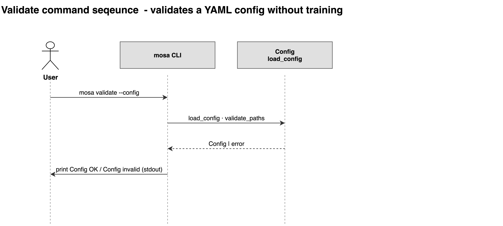

# validate

Checks a config, and the data it points at, without training.

```bash
mosa validate --config <your-config>.yaml
```

| Flag | Type | Required | Description |
|---|---|---|---|
| `-c`, `--config` | path | yes | Path to YAML config file |



## Outputs

```
Warning: No 'mutation_*' columns in data; mutation conditioning will be disabled.
Config OK
  data:    <data>.h5mu
  views:   ['gexp', 'meth'] (discrete: [])
  model:   MOSAConfig
  output:  <output-dir>
  seed:    42
  eval:    test_size=0.1, n_folds=5, strategy=stratified, shuffle=True
  arch:    fusion=concat, latent=8
  train:   epochs=2, batch_size=8
```

Checks run cheapest first: YAML parsing and key names, then path existence,
then a structural summary of the data, then model-specific requirements.

Hard failures raise and exit 1: a missing path or view, a missing mask layer,
no `model_type` column, a `target_batch` naming a category the data does not
have.

Conditions that degrade rather than fail are printed as warnings and still exit
0: no `tissue` column while tissue conditioning is on, no `mutation_*` columns
while mutation conditioning is on, or adversarial correction configured with
fewer than two `model_type` categories.

## Limitations

No matrices are loaded. Validation reads structure metadata only, so it stays
fast on large files and correspondingly cannot see anything about the values
themselves. Use [inspect](07-inspect.md) for those.

See also: [Configuration](../03-configuration.md) ·
[Troubleshooting](../09-troubleshooting.md)
