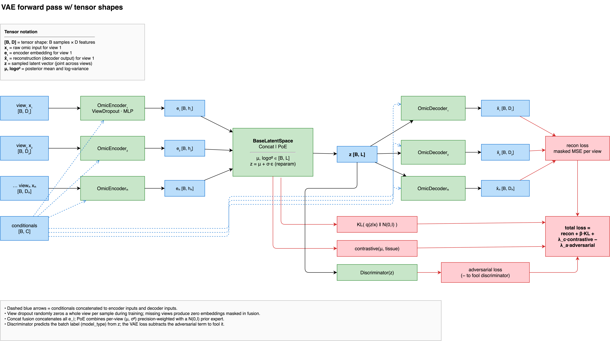
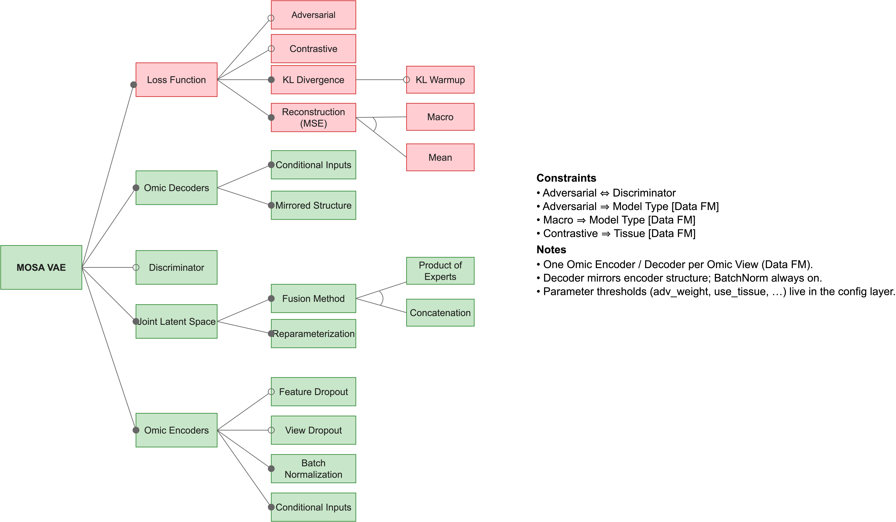

# The MOSA VAE

This page explains what the configuration keys under the `model` section control. It does not cover implementation details like tensor shapes, the training step, or the manual optimisation loop.

Every view passes through its own encoder. The model fuses these per-view embeddings into a single posterior over a shared latent space, and then samples a latent vector from it. Finally, each view uses its own decoder to reconstruct the original data from that latent vector and the per-sample conditionals.

## Per-view encoders and decoders

You configure the size of a view's encoder using `model.views.<name>.hidden_layer_dims`. The corresponding decoder automatically mirrors this architecture. Since the views are independent at this stage, you can assign differently sized paths to a 20,000-feature expression matrix and an 800-feature methylation matrix.

A sample missing from a particular view contributes a zeroed embedding, and the model masks out its reconstruction loss for that view. You do not have to impute missing views before training.

The `recon_weight` setting scales a view's contribution to the total reconstruction loss. The `loss_type` setting dictates how the model averages that error across `model_type` groups.

## Fusion

The `fusion_method` key determines how the per-view embeddings merge into a single posterior.

Setting this to `concat` concatenates the embeddings and passes them through a head that produces mu and logvar. A view must be present for its slot in the concatenated vector to carry information. The resulting latent representation depends heavily on which views a sample has.

Setting this to `poe` treats each view as an independent expert with its own Gaussian opinion about the latent space, and multiplies these distributions. This method is precision-weighted. An absent view simply contributes nothing to the product rather than contributing a zero, and a confident view dominates an uncertain one. If you enable `poe_use_shared_head`, the model shares the mu and logvar heads across all views. This requires the last `hidden_layer_dims` entry to match across every view.

You can insert additional layers after the fusion step and before the latent head using `shared_hidden_layer_dims`. If you leave this empty, the fused representation passes straight to the head.

The `view_dropout_prob` setting drops entire views at random during training. This prevents the model from relying exclusively on any single view always being present.

## Conditionals

The decoders receive per-sample side information alongside the latent vector. They always receive `model_type`. They receive `tissue` if `data.use_tissue` is enabled and the column exists. They receive the `mutation_*` columns if `data.use_mutations` is enabled.

Passing `model_type` to the decoder instead of the encoder removes source-specific information from the latent space and explicitly tells the decoder which source it is reconstructing. This architecture enables counterfactual inference. You can fix the `model_type` input to a specific category during inference, and the model will reconstruct every sample as if it originated from that category.

## Loss

The total loss comprises four terms. Three of them are optional.

The reconstruction term calculates the error over observed entries only. It calculates this per view, weights it by `recon_weight`, and averages it according to `loss_type`.

The KL divergence term calculates the divergence between the posterior and a standard normal distribution, weighted by `kl_weight`. The KL calculation sums over the `joint_latent_dim`. A larger latent space requires a proportionally smaller weight to achieve the same effective regularisation pressure.

The contrastive term operates on the posterior mean. It pulls together samples that share a `tissue` label. You can disable it by setting `contrastive_weight` to 0. It automatically degrades to zero if no `tissue` column is present.

The adversarial term uses a discriminator to predict the `model_type` from the latent space, while the encoders train to prevent this prediction. This forces the latent space to retain less source-specific signal. You can disable it by setting `adv_weight` to 0. This term only functions if your data contains at least two `model_type` categories. You can use `adv_focal_gamma` to shift the discriminator's cross-entropy toward hard examples, and `use_adv_class_weights` to compensate for imbalanced categories.

## Preprocessing

The `preprocessing_mode` setting dictates how the model processes continuous views before passing them to an encoder. The [Configuration](03-configuration.md#model-for-type-mosa_vae) page defines the three available modes.

Regardless of the chosen mode, the model fits the scalers on the training split only and saves them. When you run `transform` on new data, it reuses those saved scalers instead of refitting them. This guarantees that your new projections remain comparable to the original training run.

See also: [Configuration](03-configuration.md)
